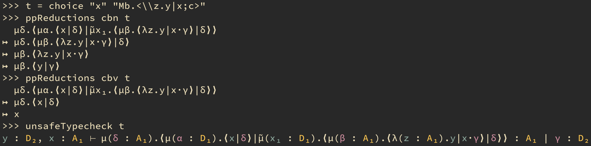

# lambda-mu-mu-calculus

Interpreter for λ̅μμ̃-calculus of Herbelin and Curien (for educational purposes).



## How to use

The most convenient way to use the interpreter is to do so from within GHCi. Use the following command to enable colored output:

```sh
stack repl --ghc-options='-interactive-print=LambdaMuMuCalculus.Typed.Colored.printColored'
```

It is recommended to `import qualified` modules, e.g.:

```
import qualified LambdaMuMuCalculus.Untyped as Untyped
```

### Parsing terms

Terms, commands and contexts have convenient `IsString` instances, allowing you to write string literals (assuming `-XOverloadedStrings`).
You can use Unicode letters or enter terms using ASCII symbols (or mix both):

- `\` for `λ` (λ-abstraction)
- `M` for `µ` (µ-abstraction)
- `M'` for `μ̃` (μ̃-abstraction)
- `a`, `b`, etc. for `α`, `β`, etc. (covariables)
- `x1` for `x₁`, etc. ((co)variables with indices)
- `<x|a>` for `⟨x|α⟩` (commands)
- `x;a` for `x·α` (contexts)

For example:

```
>>> "Ma.<\\x.y|M'f.<f|z;a>>" :: Untyped.Term'
µα.⟨λx.y|μ̃f.⟨f|z·α⟩⟩
```

### Normalization

The two most useful methods for normalization are

1. `nf` (reduce to normal form) and
2. `ppReductions` (to pretty-print reduction steps)

Both accept an evaluation strategy as the first argument, which can

1. `cbn` — for call-by-name evaluation
2. `cbv` — for call-by-value evaluation

Examples:

```
>>> nf cbn "Ma.<\\x.y|M'f.<f|x;a>>" :: Untyped.Term'
y
>>> ppReductions cbn "Ma.<\\x.y|M'f.<f|x;a>>"
  µα.⟨λx.y|μ̃f.⟨f|x·α⟩⟩
↦ µα.⟨λx.y|x·α⟩
↦ µα.⟨y|α⟩
↦ y
```

### Predefined terms

See `LambdaMuMuCalculus.Untyped.Church` for some predefined terms, including
Church-encoded booleans, natural numbers, pairs and lists.

#### Booleans

```
>>> false
λt.λf.f
>>> true
λt.λf.t
>>> ppReductions cbn (app2 false "x" "y")
  µα.⟨µα.⟨λt.λf.f|x·α⟩|y·α⟩
↦ µα.⟨λt.λf.f|x·y·α⟩
↦ µα.⟨λf.f|y·α⟩
↦ µα.⟨y|α⟩
↦ y
```

#### Natural numbers

```
>>> 4 :: Untyped.Term'
λs.λz.µα.⟨s|µα.⟨s|µα.⟨s|µα.⟨s|z·α⟩·α⟩·α⟩·α⟩
>>> 2 + 2 :: Untyped.Term'
µα.⟨µα.⟨λn.λm.λs.λz.µα.⟨n|s·µβ.⟨m|s·z·β⟩·α⟩|λs.λz.µα.⟨s|µα.⟨s|z·α⟩·α⟩·α⟩|λs.λz.µα.⟨s|µα.⟨s|z·α⟩·α⟩·α⟩
>>> nf cbn (2 + 2) === (4 :: Untyped.Term')
True
>>> ppReductions cbn (2 + 2)
  µα.⟨µα.⟨λn.λm.λs.λz.µα.⟨n|s·µβ.⟨m|s·z·β⟩·α⟩|λs.λz.µα.⟨s|µα.⟨s|z·α⟩·α⟩·α⟩|λs.λz.µα.⟨s|µα.⟨s|z·α⟩·α⟩·α⟩
↦ µα.⟨λn.λm.λs.λz.µα₁.⟨n|s·µβ.⟨m|s·z·β⟩·α₁⟩|λs.λz.µα₁.⟨s|µα₂.⟨s|z·α₂⟩·α₁⟩·λs.λz.µα.⟨s|µα.⟨s|z·α⟩·α⟩·α⟩
↦ µα.⟨λm.λs.λz.µα₁.⟨λs.λz.µα₁.⟨s|µα₂.⟨s|z·α₂⟩·α₁⟩|s·µβ.⟨m|s·z·β⟩·α₁⟩|λs.λz.µα.⟨s|µα.⟨s|z·α⟩·α⟩·α⟩
↦ µα.⟨λs.λz.µα₁.⟨λs₁.λz₁.µα₂.⟨s₁|µα₃.⟨s₁|z₁·α₃⟩·α₂⟩|s·µβ.⟨λs.λz.µα.⟨s|µα.⟨s|z·α⟩·α⟩|s·z·β⟩·α₁⟩|α⟩
↦ λs.λz.µα₁.⟨λs₁.λz₁.µα₂.⟨s₁|µα₃.⟨s₁|z₁·α₃⟩·α₂⟩|s·µβ.⟨λs.λz.µα.⟨s|µα.⟨s|z·α⟩·α⟩|s·z·β⟩·α₁⟩
↦ λs.λz.µα₁.⟨λz₁.µα₂.⟨s|µα₃.⟨s|z₁·α₃⟩·α₂⟩|µβ.⟨λs.λz.µα.⟨s|µα.⟨s|z·α⟩·α⟩|s·z·β⟩·α₁⟩
↦ λs.λz.µα₁.⟨µα₂.⟨s|µα₃.⟨s|µβ.⟨λs.λz.µα.⟨s|µα.⟨s|z·α⟩·α⟩|s·z·β⟩·α₃⟩·α₂⟩|α₁⟩
↦ λs.λz.µα₂.⟨s|µα₃.⟨s|µβ.⟨λs.λz.µα.⟨s|µα.⟨s|z·α⟩·α⟩|s·z·β⟩·α₃⟩·α₂⟩
↦ λs.λz.µα₂.⟨s|µα₃.⟨s|µβ.⟨λz.µα.⟨s|µα₁.⟨s|z·α₁⟩·α⟩|z·β⟩·α₃⟩·α₂⟩
↦ λs.λz.µα₂.⟨s|µα₃.⟨s|µβ.⟨µα.⟨s|µα₁.⟨s|z·α₁⟩·α⟩|β⟩·α₃⟩·α₂⟩
↦ λs.λz.µα₂.⟨s|µα₃.⟨s|µα.⟨s|µα₁.⟨s|z·α₁⟩·α⟩·α₃⟩·α₂⟩
```

#### Pairs

```
>>> pair false 1
λp.µα.⟨µα.⟨p|λt.λf.f·α⟩|λs.λz.µα.⟨s|z·α⟩·α⟩
>>> nf cbn (app1 first (pair false 1))
λt.λf.f
>>> nf cbn (app1 second (pair false 1))
λs.λz.µα₁.⟨s|z·α₁⟩
```

#### Lists

```
>>> list [1, 2, 3]
λf.λz.µα.⟨f|λs.λz.µα.⟨s|z·α⟩·µα.⟨f|λs.λz.µα.⟨s|µα.⟨s|z·α⟩·α⟩·µα.⟨f|λs.λz.µα.⟨s|µα.⟨s|µα.⟨s|z·α⟩·α⟩·α⟩·z·α⟩·α⟩·α⟩
>>> nf cbn (app2 (list [1, 2, 3]) add 0)
λs.λz.µα₃.⟨s|µα₄.⟨s|µα₅.⟨s|µα₆.⟨s|µα₇.⟨s|µα₈.⟨s|z·α₈⟩·α₇⟩·α₆⟩·α₅⟩·α₄⟩·α₃⟩
>>> nf cbn (app2 (list [1, 2, 3]) add 0) === 6
True
```

#### Choice

Because the calculus is not confluent, we can exploit it to encode non-deterministic terms:

```
>>> choice "z1" "z2"
µδ.⟨µα.⟨z₁|δ⟩|μ̃x.⟨z₂|δ⟩⟩
>>> nf cbn (choice "z1" "z2")
z₂
>>> nf cbv (choice "z1" "z2")
z₁
```
